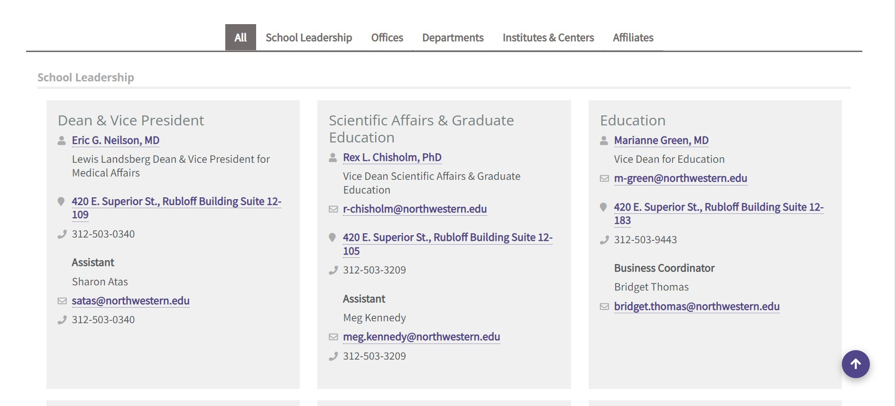

# excel-vba-webscraping  

Author:  Erin James Wills, ejw.data@gmail.com  

<cite>Photo by [Ilya Pavlov](https://unsplash.com/@ilyapavlov?utm_source=unsplash&utm_medium=referral&utm_content=creditCopyText) on [Unsplash](https://unsplash.com/s/photos/web?utm_source=unsplash&utm_medium=referral&utm_content=creditCopyText)</cite>
## Overview

  
So this was not a project I ever anticipated doing but was asked by a coworker to help simplify things for them.  During the pandemic, personnel information like office phone numbers and key contacts were changing frequently.  Do to the need to work closely with the medical school, I created this simple excel vba webscraper.     

`Normally, I would do something like this in Python but the people who would utilize this would only feel comfortable with Excel.`    

Overall, this accomplishes the job but no extra time was spent making it a nice looking spreadsheet.  The person needing the information could quickly format it to their liking but this eleminated the need for copying and pasting content.  

   

## Technologies  
*  Excel:  VBA, HTTP Library  
   

## Data Source   
This was last tested in 2021 on the Feinberg website.  It was used for about two years.  Images of the content being scraped is below.  The website used tabs to differentiate organizations and also used HTML Cards to group the data.  The individual organizations had quite a bit of differences in their organization structure and data provided.  The webscrape obtained about 90-95% of the necessary data.  

  

  

 

## Installation Instructions  
1.  Clone the repo
1.  Open the macro-enabled spreadsheet (.xlsm)
1.  Accept any Security Warnings
1.  Activate the HTTP library by going to:  
    1.  File > Options > Add-Ons
    1.  Add a Checkmark next to HTTP Library
1.  Make the Devloper tab visible by going to:  
    1.  File > Options
    1.  Select from the list of folders, Developer  
1.  To run the program, click on the Develop Tab
1.  Click the Macros button
1.  Select the function and click run.  
** The sheets (tabs) will start populating.  
